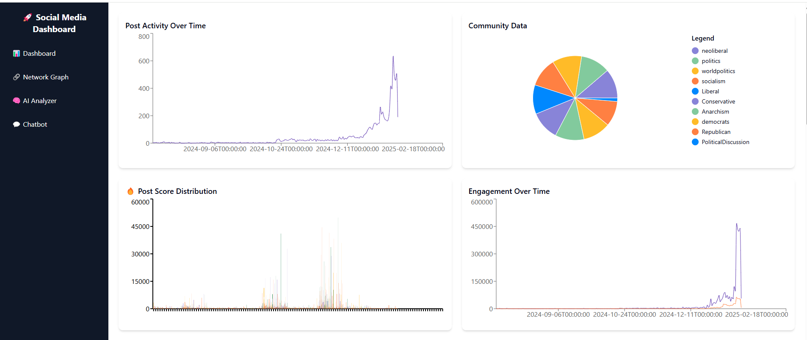
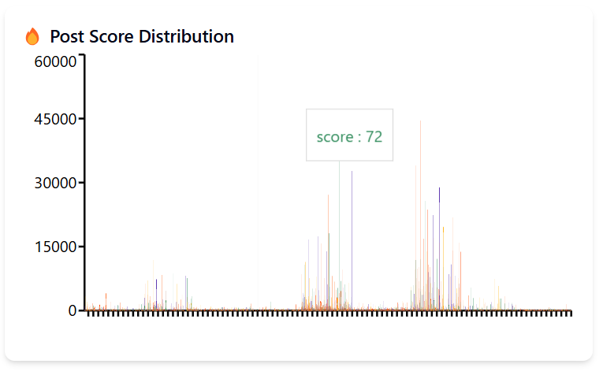
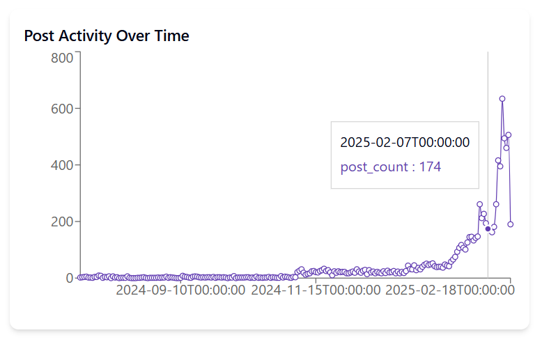
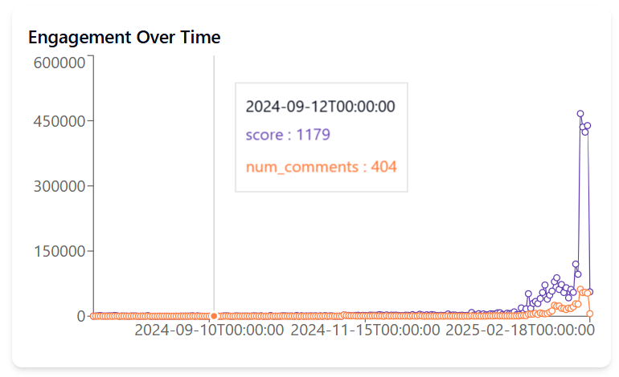
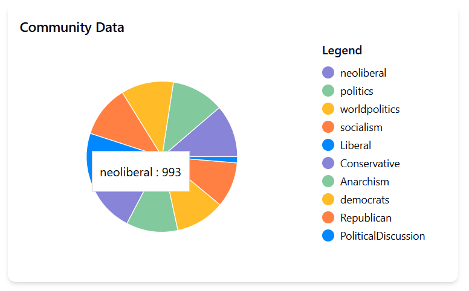
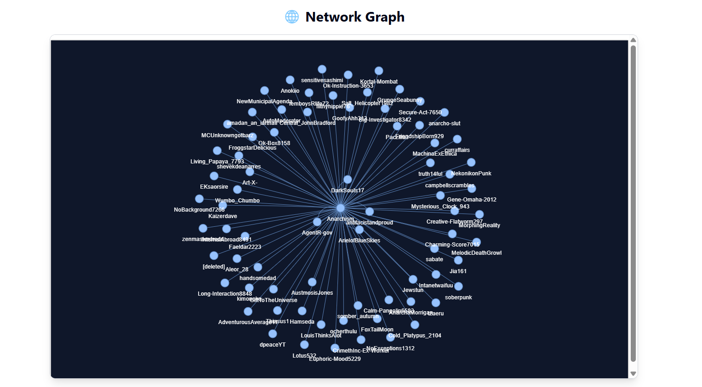
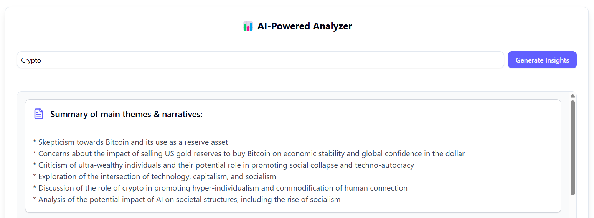

# research-engineering-intern-assignment
# 🚀 Social Media Analytics Dashboard  

An **AI-powered Next.js dashboard** that provides **insights, network visualization, and chatbot assistance** for analyzing social media data using **FastAPI, Groq (Llama3-8B), and Recharts**.

## ✨ Features  
✅ **Interactive Time-Series Analysis** – Track engagement trends over time  
✅ **Subreddit & Post Distribution Charts** – Analyze post activities across subreddits  
✅ **AI-Powered Analyzer** – Uses Llama3-8B to generate structured insights  
✅ **Real-Time Chatbot** – Provides conversational insights with Llama3-8b  
✅ **Network Visualization** – Displays author connections using PyVis 

---

## 🛠️ **Tech Stack**  
### **Frontend (Next.js + ShadCN)**
- **Next.js** – React-based framework for building fast web apps  
- **ShadCN UI** – Customizable UI components  
- **Recharts** – Data visualization for charts  

### **Backend (FastAPI + Groq + PyVis)**
- **FastAPI** – High-performance API backend  
- **Groq API** – Runs **Llama3-8B** for AI insights  
- **PyVis + NetworkX** – Generates interactive network graphs  

### **Deployment**
- **Frontend** – Hosted on **Vercel**  
- **Backend** – Hosted on **Render**  

---

## 🚀 **Setup Instructions**
### **1️⃣ Clone the Repository**
```bash
git clone https://github.com/VatsalKotha/research-engineering-intern-assignment.git
cd research-engineering-intern-assignment
```
### 2️⃣ Backend (FastAPI) Setup
🔹 Install Dependencies
```bash
cd backend
pip install -r requirements.txt
```
🔹 Run FastAPI Server
```bash
uvicorn main:app --host 0.0.0.0 --port 8000 --reload
```
📌 Backend will run on: http://127.0.0.1:8000

🔹 Start Chatbot API
```bash
uvicorn chatbot:app --host 0.0.0.0 --port 8001 --reload
```
📌 Chatbot API will run on: http://127.0.0.1:8001

 ### 3️⃣ Frontend (Next.js) Setup
🔹 Install Dependencies
```bash
cd ./socialmedia-dashboard
npm install
```

🔹 Configure .env.local
Create a .env.local file inside socialmedia-dashboard/ and add:

.env.local
```bash
NEXT_PUBLIC_API_URL=https://your-fastapi-backend.onrender.com
NEXT_PUBLIC_CHATBOT_API_URL=https://chatbot-axvr.onrender.com
```
🔹 Run Next.js Development Server
```bash
npm run dev
```
📌 Frontend will run on: http://localhost:3000

### 📊 Usage Guide
### 1️⃣ AI Analyzer
 🔹Enter any keyword or topic. <br>
 🔹Click "Generate Insights".<br>
 🔹AI provides structured insights with sentiment analysis, patterns & recommendations.<br>
### 2️⃣ Chatbot
 🔹Start a conversation with the chatbot. <br>
 🔹It remembers context and provides AI-generated responses. <br>
### 3️⃣ Network Visualization
 🔹Displays author relationships based on shared hashtags & URLs. <br>

## 📸 Screenshots  

### 🔹 **Dashboard View**  


### 🔹 **Post Score Distribution**  


### 🔹 **Post Activity Over Time**  


### 🔹 **Engagement Over Time**  


### 🔹 **Community Data **  


### 🔹 **Network graph**  


### 🔹 **AI Insights**  


### 🔹 **AI Chatbot**  


## 🏆 **Contributors**
- **👨‍💻 [Vatsal Kotha](https://github.com/VatsalKotha)**
